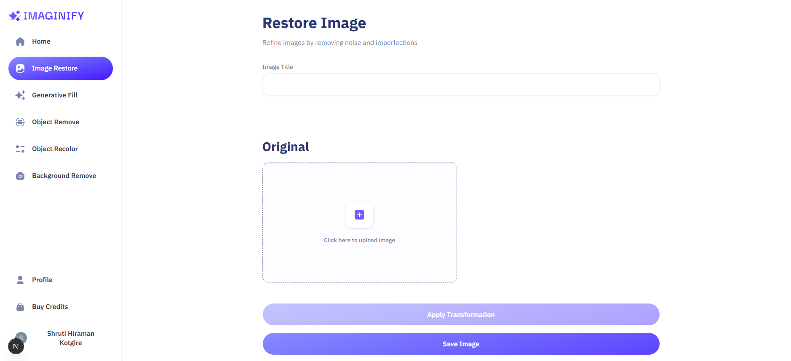
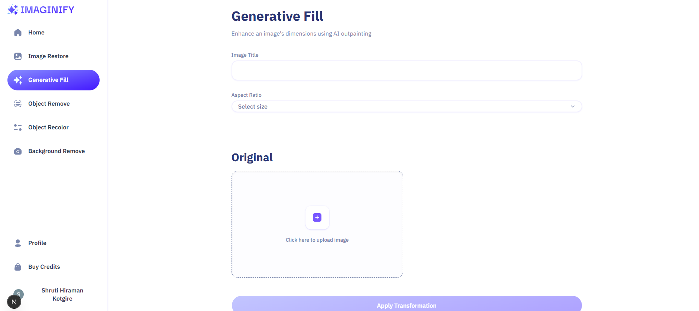
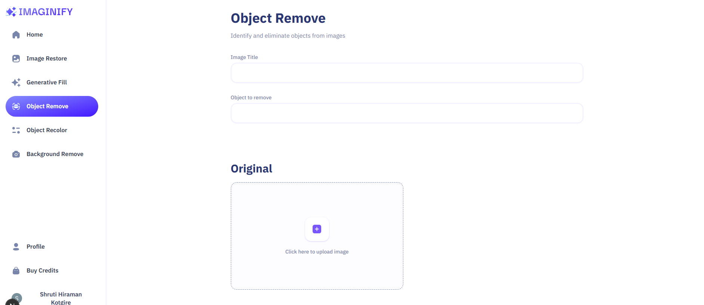
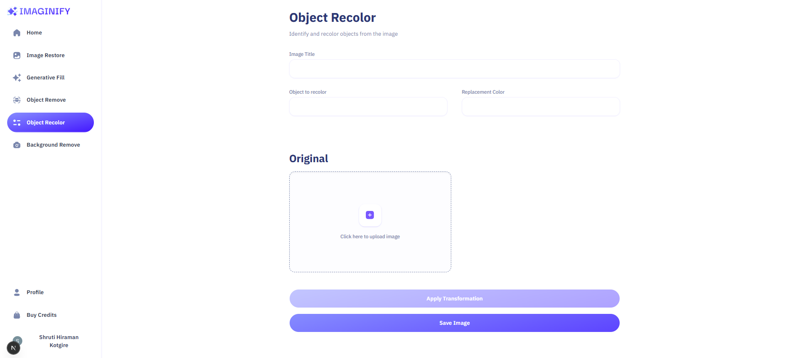
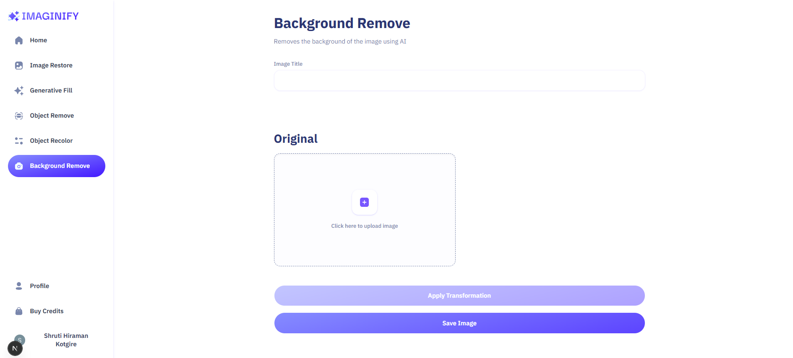
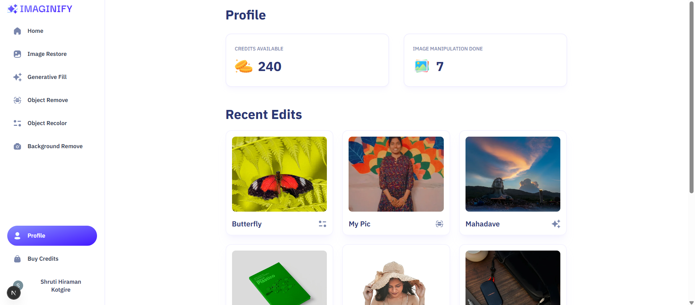
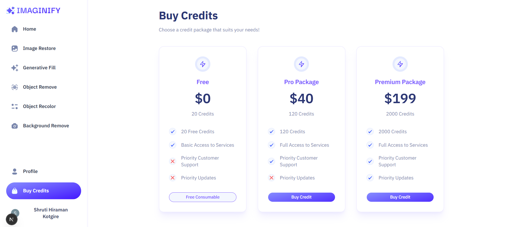

# ✨ Imaginify

### AI-Powered Image Transformation SaaS

Imaginify is a full-stack AI-powered image transformation platform that allows users to upload, transform, manage, and download images through a modern SaaS interface.

Built with **Next.js, TypeScript, MongoDB, Cloudinary, Clerk, and Stripe**, Imaginify combines AI-powered image manipulation with authentication, cloud image management, credit-based usage, and payments.

<p align="center">
  <a href="https://imaginify-six-gold.vercel.app/">
    
  </a>
  <a href="https://github.com/shrutikotgire0129/imaginify">
    
  </a>
</p>

---

## 📸 Preview


---

## 🚀 Features

### 🖼️ AI Image Transformations

Imaginify provides multiple image transformation capabilities through Cloudinary's image processing infrastructure.

* **Image Restoration** — Restore and enhance images
* **Generative Fill** — Extend images beyond their original boundaries
* **Object Removal** — Remove unwanted objects from images
* **Object Recoloring** — Change the color of selected objects
* **Background Removal** — Automatically remove image backgrounds

### 🔐 Authentication

Secure authentication and user management powered by Clerk.

* User sign up and sign in
* Protected application routes
* User-specific data
* Authenticated image management
* Secure access to application features

### 💳 Credit-Based Usage

Imaginify follows a credit-based SaaS model.

* Users have a credit balance
* Image transformations consume credits
* Credits are associated with individual users
* Users can purchase additional credits
* Credit usage is integrated into the transformation workflow

### 💰 Stripe Payments

Stripe is integrated to handle credit purchases.

* Secure checkout
* Credit purchase flow
* Stripe payment processing
* Payment-based credit management

### ☁️ Cloud Image Management

Cloudinary handles image upload, storage, delivery, and transformation.

* Image uploads
* Cloud-based image storage
* AI-powered transformations
* Optimized image delivery
* Transformed image management

### 📱 Responsive Interface

The application is designed to work across different screen sizes.

* Desktop
* Tablet
* Mobile

---

## 🖼️ Application Screenshots

### 🏠 Home Page

The main dashboard provides access to the available image transformation tools.


### 🔧 Image Restoration

Restore and enhance images using the image restoration workflow.



### ✨ Generative Fill

Extend images beyond their original boundaries using generative fill.



### 🪄 Object Removal

Remove unwanted objects from an image.



### 🎨 Object Recoloring

Change the color of selected objects within an image.



### 🖼️ Background Removal

Remove the background from an uploaded image.



### 👤 Profile

View account information and manage available credits.



### 💳 Buy Credits

Purchase additional credits through the integrated payment system.



---

## 🏗️ Architecture

```text
                              ┌──────────────────┐
                              │       User       │
                              └────────┬─────────┘
                                       │
                                       ▼
                              ┌──────────────────┐
                              │   Clerk Auth     │
                              │ Authentication   │
                              └────────┬─────────┘
                                       │
                                       ▼
                         ┌───────────────────────────┐
                         │         Next.js           │
                         │ React + Server-side Logic │
                         └───────┬───────────┬───────┘
                                 │           │
                    ┌────────────┘           └────────────┐
                    ▼                                     ▼
             ┌─────────────┐                       ┌─────────────┐
             │   MongoDB   │                       │ Cloudinary  │
             │  + Mongoose │                       │    Images   │
             └──────┬──────┘                       └─────────────┘
                    │
                    ▼
             ┌─────────────┐
             │   Credits   │
             │  & User Data│
             └──────┬──────┘
                    │
                    ▼
             ┌─────────────┐
             │   Stripe    │
             │  Payments   │
             └─────────────┘
```

---

## 🔄 Application Workflow

### Image Transformation Flow

```text
User
 │
 ▼
Upload Image
 │
 ▼
Select Transformation
 │
 ▼
Validate Request
 │
 ▼
Check Available Credits
 │
 ▼
Process Image
 │
 ▼
Cloudinary Transformation
 │
 ▼
Display Result
 │
 ▼
Download / Manage Image
```

### Credit & Payment Flow

```text
User
 │
 ▼
Select Credit Package
 │
 ▼
Stripe Checkout
 │
 ▼
Payment Processing
 │
 ▼
Credits Added to Account
 │
 ▼
User Performs Transformation
 │
 ▼
Credits Consumed
```

---

## 🛠️ Tech Stack

### Frontend

* **Next.js**
* **React**
* **TypeScript**
* **Tailwind CSS**
* **shadcn/ui**
* **Lucide React**
* **React Hook Form**

### Backend & Database

* **Next.js Server-side Logic**
* **MongoDB**
* **Mongoose**
* **Zod**

### Authentication

* **Clerk**

### Image Processing & Storage

* **Cloudinary**
* **Next Cloudinary**

### Payments

* **Stripe**

### Development

* **ESLint**
* **TypeScript**
* **npm**

---

## 📁 Project Structure

```text
imaginify/
│
├── app/
│   ├── ...                       # Application routes and pages
│   └── ...
│
├── components/
│   ├── ...                       # Reusable UI components
│   └── ...
│
├── constants/
│   └── ...                       # Application constants
│
├── lib/
│   ├── ...                       # Utilities and service logic
│   └── ...
│
├── public/
│   └── screenshots/
│       ├── home-page.png
│       ├── image-restore.png
│       ├── generative-fill.png
│       ├── object-remove.png
│       ├── object-recolor.png
│       ├── bg-remove.png
│       ├── profile.png
│       └── buy-credits.png
│
├── types/
│   └── ...                       # TypeScript types
│
├── proxy.ts
├── next.config.ts
├── package.json
├── tsconfig.json
└── README.md
```

---

## ⚙️ Getting Started

### Prerequisites

Make sure you have the following installed:

* Node.js
* npm
* MongoDB
* Clerk account
* Cloudinary account
* Stripe account

### 1. Clone the Repository

```bash
git clone https://github.com/shrutikotgire0129/imaginify.git

cd imaginify
```

### 2. Install Dependencies

```bash
npm install
```

### 3. Configure Environment Variables

Create a `.env.local` file in the project root.

```env
# Clerk
NEXT_PUBLIC_CLERK_PUBLISHABLE_KEY=
CLERK_SECRET_KEY=

# MongoDB
MONGODB_URL=

# Cloudinary
NEXT_PUBLIC_CLOUDINARY_CLOUD_NAME=
CLOUDINARY_API_KEY=
CLOUDINARY_API_SECRET=

# Stripe
STRIPE_SECRET_KEY=
NEXT_PUBLIC_STRIPE_PUBLISHABLE_KEY=
STRIPE_WEBHOOK_SECRET=
```

> Never commit `.env.local` or expose secret API keys.

### 4. Run the Development Server

```bash
npm run dev
```

Open the application at:

```text
http://localhost:3000
```

---

## 🔑 Required Services

| Service        | Purpose                            |
| -------------- | ---------------------------------- |
| **Clerk**      | Authentication and user management |
| **MongoDB**    | Application database               |
| **Cloudinary** | Image storage and transformation   |
| **Stripe**     | Payments and credit purchases      |

---

## 🧠 Engineering Highlights

Imaginify demonstrates several real-world full-stack development concepts:

* Modern Next.js application architecture
* TypeScript-based development
* Authentication and protected routes
* User-specific application data
* AI-powered image transformation workflows
* Cloud-based image management
* Credit-based SaaS architecture
* Stripe payment integration
* MongoDB data persistence
* Mongoose data modeling
* Server-side application logic
* Schema validation with Zod
* Form handling with React Hook Form
* Responsive UI development
* Third-party service integration

---

## 🔒 Security

The application uses environment variables to keep sensitive service credentials outside the source code.

Security considerations include:

* Never expose secret API keys
* Never commit `.env.local`
* Protect authenticated routes
* Validate user input
* Perform sensitive operations server-side
* Verify payment events securely
* Validate credit usage on the server

---

## 🚧 Future Improvements

* [ ] Add unit tests
* [ ] Add integration tests
* [ ] Add end-to-end testing
* [ ] Add rate limiting for resource-intensive operations
* [ ] Improve error handling and user feedback
* [ ] Make credit updates transaction-safe
* [ ] Add GitHub Actions CI/CD
* [ ] Add monitoring and error tracking
* [ ] Add usage analytics
* [ ] Improve transformation history
* [ ] Improve accessibility

---

## 📚 Key Learning Outcomes

Through this project, I worked with:

* Full-stack Next.js development
* TypeScript
* Authentication and authorization
* MongoDB and Mongoose
* Cloudinary image processing
* AI-powered image transformation
* Stripe payment integration
* Credit-based SaaS architecture
* Server-side logic
* Third-party API integration
* Form validation
* Responsive UI development

---

## 👩‍💻 Author

### Shruti Kotgire

**Engineering Graduate | Full-Stack Developer**

* GitHub: [@shrutikotgire0129](https://github.com/shrutikotgire0129)
* Project: [Imaginify](https://github.com/shrutikotgire0129/imaginify)

---

## ⭐ Support

If you find this project interesting, consider giving the repository a ⭐ on GitHub.

---

## 📄 License

This project is intended for educational and portfolio purposes.
